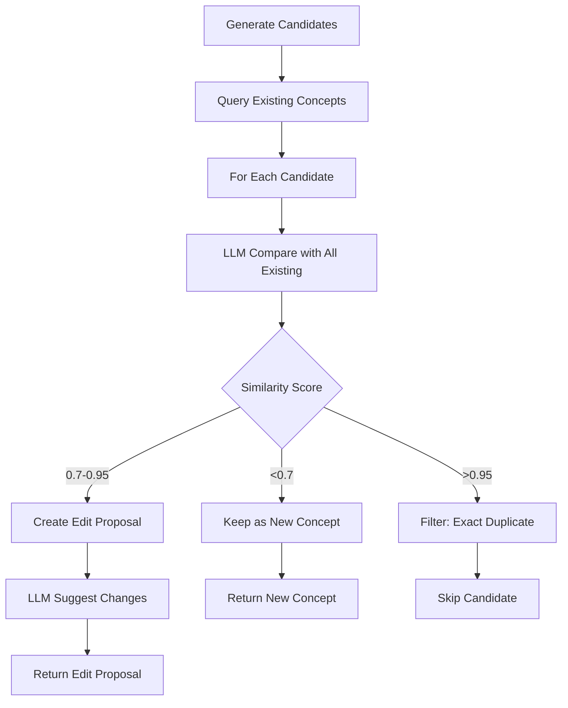

# Concept Duplicate Detection

and Edit Proposals

## Overview

Modify the concept generation system to detect duplicates using semantic similarity (LLM-based) and propose edits/additions to existing concepts instead of creating duplicates. Filter exact duplicates entirely, and for similar concepts, generate edit proposals that show the existing concept with suggested updates.

## Architecture Changes

### 1. Update `generateConceptCandidates` Function

**File:** `src/server/services/conceptProposer.ts`

- Add optional `database` parameter to allow querying existing concepts
- After generating candidates, query all active concepts from database
- Use LLM to compare each candidate against existing concepts
- Return enhanced result type that includes:
- New concepts (no matches found)
- Edit proposals (similar concepts found with suggested changes)

### 2. Create New Types

**File:** `src/server/services/conceptProposer.ts`

```typescript
export interface ConceptEditProposal {
  type: 'edit';
  existingConceptId: string;
  existingConcept: {
    id: string;
    title: string;
    description: string;
    content: string;
    creator: string;
    source: string;
    year: string;
  };
  suggestedChanges: {
    title?: string;
    description?: string;
    content?: string;
    additionalContent?: string; // New content to append
  };
  similarityScore: number; // 0-1
  reasoning: string; // Why this is similar and what should change
}

export interface ConceptCandidateResult {
  type: 'new';
  candidate: ConceptCandidate;
}

export type ConceptProposal = ConceptCandidateResult | ConceptEditProposal;
```


### 3. Implement Semantic Similarity Detection

**File:** `src/server/services/conceptProposer.ts`Create new function `detectDuplicatesAndProposeEdits`:

- Takes generated candidates and existing concepts
- Uses LLM to compare each candidate against all existing concepts
- Returns array of `ConceptProposal` objects
- LLM prompt should:
- Compare title, description, and content
- Return similarity score (0-1)
- For similar concepts (score > 0.7), suggest specific edits/additions
- For exact matches (score > 0.95), mark as duplicate to filter

### 4. Update IPC Handler

**File:** `electron/ipc-handlers/concept-handlers.ts`

- Modify `concept:generateCandidates` handler to pass database instance
- Update return type to include both new concepts and edit proposals
- Ensure database is available in the handler context

### 5. Update Type Definitions

**File:** `src/types/electron-api.ts`

- Update `ConceptGenerateCandidatesResult` to return `ConceptProposal[]` instead of `ConceptCandidate[]`
- Add types for edit proposals

### 6. Update UI Components

**File:** `src/components/ConceptCandidateList.tsx`

- Update to handle both `ConceptCandidate` and `ConceptEditProposal`
- For edit proposals:
- Show existing concept details
- Display suggested changes with diff highlighting
- Add "Apply Edits" button that updates existing concept instead of creating new
- Show similarity score and reasoning

**File:** `src/components/TextInputTab.tsx`

- No changes needed (already passes candidates to ConceptCandidateList)

### 7. Create Concept Update Handler

**File:** `electron/ipc-handlers/concept-handlers.ts`

- Ensure `concept:update` handler supports partial updates
- Add handler for applying edit proposals (updates existing concept with suggested changes)

## Implementation Details

### Semantic Similarity Detection Flow




### LLM Prompt for Similarity Detection

The prompt should:

1. Compare candidate title, description, and content with existing concept
2. Return JSON with:

- `similarityScore`: 0-1
- `isDuplicate`: boolean (score > 0.95)
- `suggestedChanges`: object with fields to update
- `reasoning`: explanation of similarity and changes

### Performance Considerations

- Batch comparisons: Compare multiple candidates in single LLM call if possible
- Limit existing concepts: Only compare against recent/active concepts if database is large
- Cache results: Consider caching similarity scores for repeated comparisons

## Testing Strategy

1. Test with exact duplicate titles
2. Test with semantically similar but different concepts
3. Test with completely new concepts
4. Test edit proposal UI rendering
5. Test applying edits to existing concepts